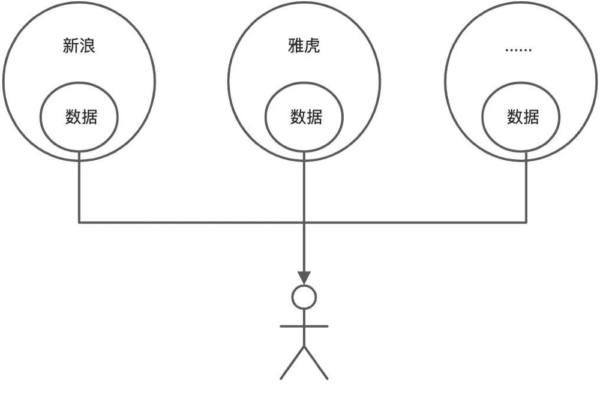
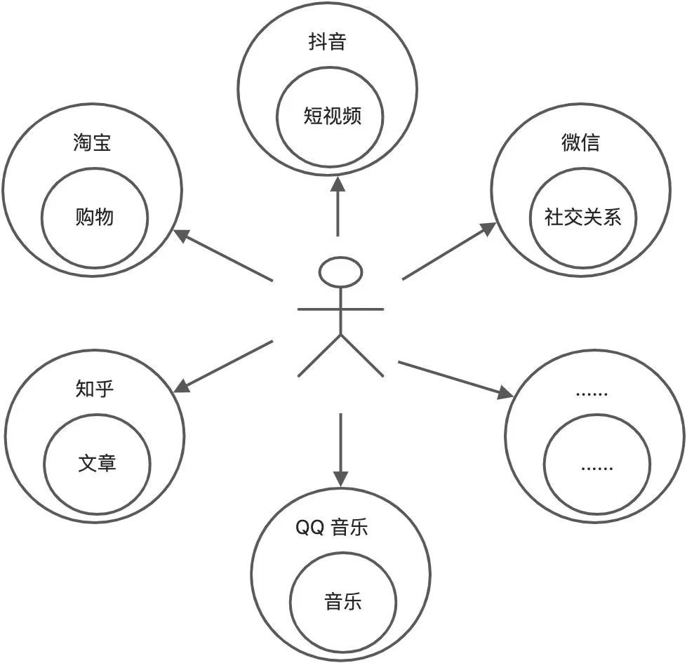
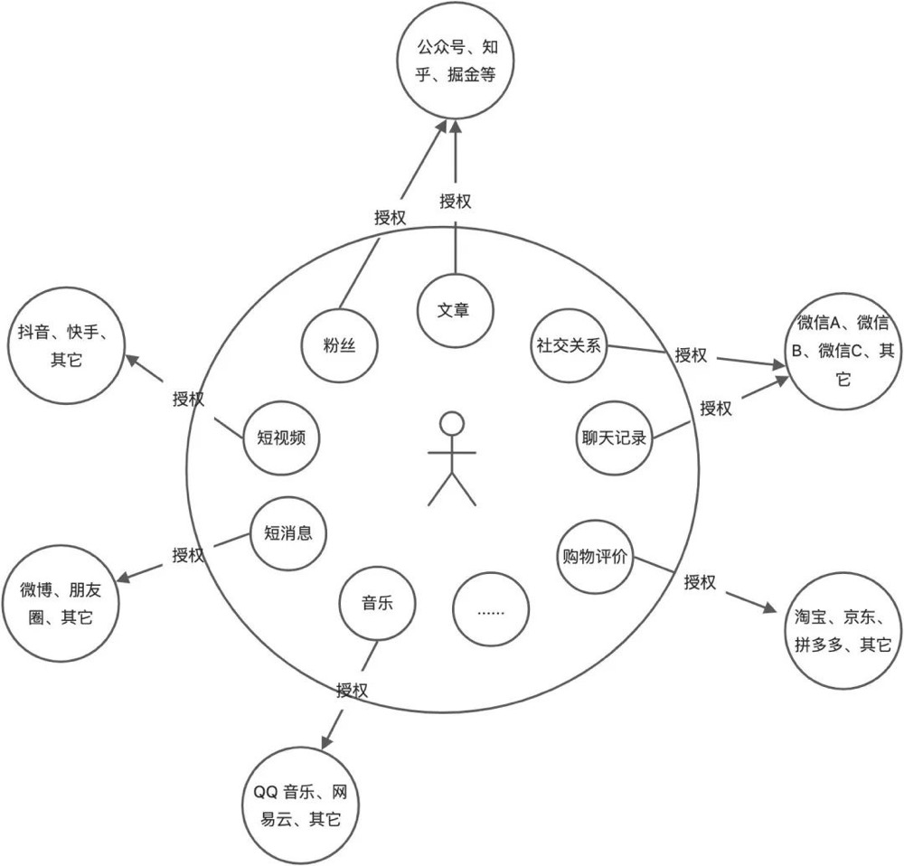

我们目前处于的互联网是 Web2.0 时代，互联网上其实一直都有关于 Web3.0 时代的畅想。和区块链有关的 Web3.0 概念是由以太坊联合创始人 Gavin Wood 在 2014 年提出的。

对于 Web3.0，目前有几种不同的理解：

**第一种理解：**

- Web1.0 为“可读”（read）；
- Web2.0 为“可读+可写”（read+write）；
- Web3.0 则是“可读+可写+拥有”（read+write+own）。

**第二种理解：**

- Web1.0 为“半中心化”；
- Web2.0 为“中心化”；
- Web3.0 则是“去中心化”。

Web1.0 时代除中心门户外个人网站也占据半壁江山，两者鼎立形成“半中心化”生态；Web2.0 时代则形成信息孤岛，大公司垄断数据；Web3.0 时代则是纯粹“去中心化”，数据由用户主宰。

**第三种理解：**

- Web1.0、Web2.0 为信息互联网；
- Web3.0 则是价值互联网。

Web1.0、Web2.0 本质上是在传递信息，侧重消费；而 Web3.0 则是在传递价值，创造财富。

所以，Web3.0 可以简单的理解为加入了区块链技术的互联网，它要逆转现在互联网“中心垄断”难题，帮助用户拿回自己的数据主权，从而在数字世界里重新创造一个更高维度的互联网世界。

可以直观的得出以下一些结论：

- 它将重新打造一个基于数据的财富体系；
- 它将重构未来的跨疆域的数字支付系统；
- 出现真正跨产品平台操作的用户数据库；
- 出现基于私钥不可篡改的数字身份；
- 每个人拥有自己的数据主权并自由支配；
- 它将在虚拟世界无摩擦实现全球范围内的现代金融；
- ……

这其中的每一项，都将给人类带来一种全新变革。

**Web1.0：平台创造、平台所有、平台控制、平台受益。**

**Web2.0：用户创造、平台所有、平台控制、平台分配。**

存在的问题：

- 所有权和收益权不合理；
- 平台垄断，并控制用户；
- 数据割裂，且无法迁移；
- 隐私问题；
- 数据可信度；
- 数据安全性；
- ……

**Web3.0：用户创造、用户所有、用户控制、协议分配。**

- 用户的数据存储在某个地方，用户对数据拥有完全控制权，未经授权，任何人不能访问和修改数据；
- 软件需要经过用户授权，才能访问用户特定的数据。
